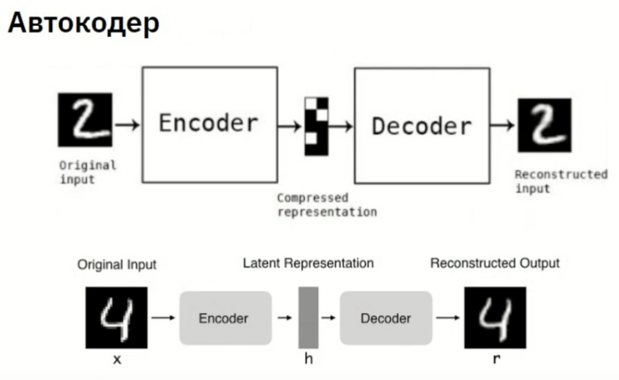
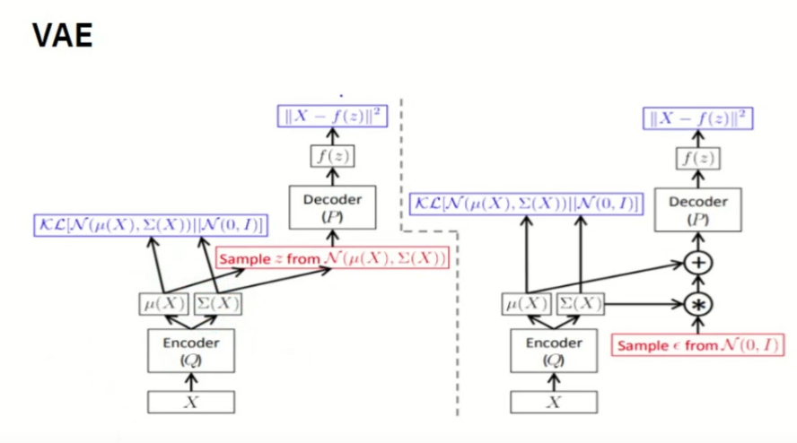
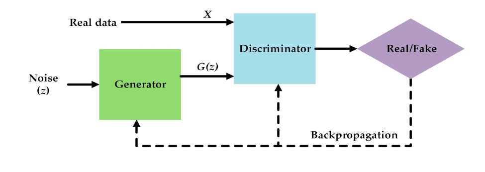
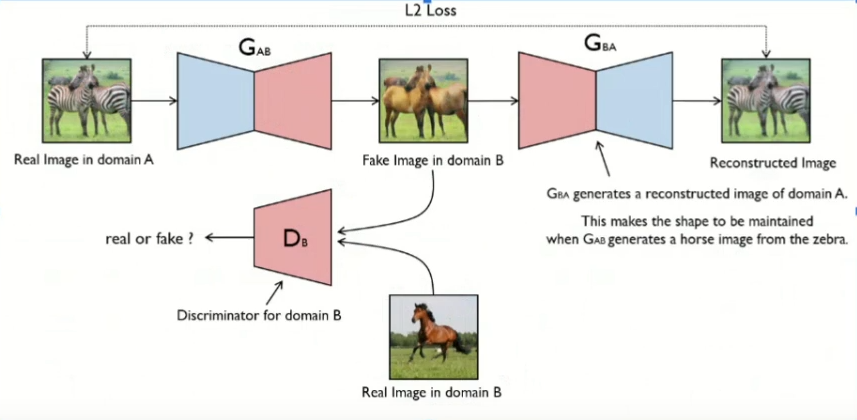
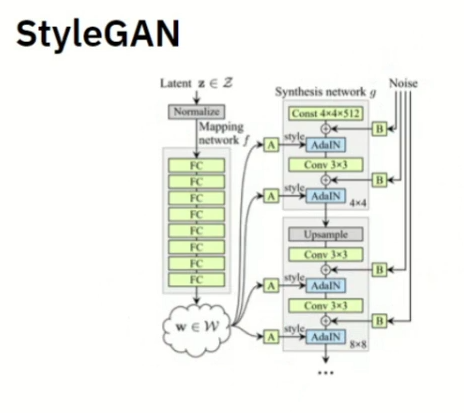
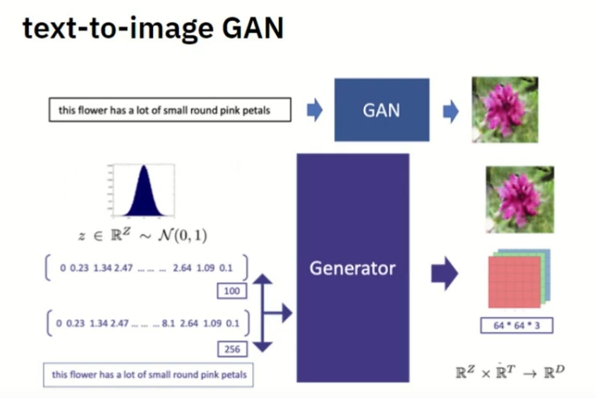
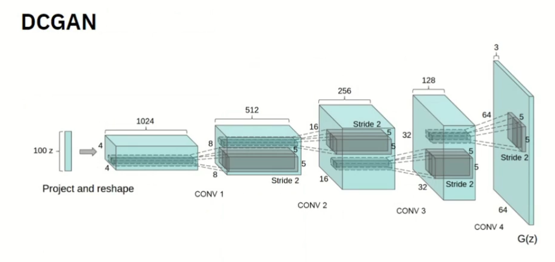

GAN - Generative Adversarial Network (Генеративно-состязательная сеть)

- используются для генерации новых объектов

Разновидности:
1) Генерация новых изображений
2) Перенос стиля (из фотографии картину, зимний пейзаж летом и тд)
3) Создание изображений по текстовому описанию
4) Дорисовка изображения по эскизу
5) Улучшение качества изображения

- помимо обработки изображений, могут работать со звуком, текстом

Базовые модели GAN.

**Автокодер**     
- состоит из двух частей:
1) энкодер - последовательность сверточных и пуллинговых слоев - получаем набор признаков, содержащихся в изображении
2) декодер - дековалюционные и пуллинговые слои - восстановление изображения до исходного

2. **VAE - Вариационный АвтоЭнкодер**

- использует генерацию новых семплов (вариации из полученного распределения)

* восстановительная функция потерь - разница между входными и восстановленными данными, 
* Кульбек-Лейблер-дивергенция - разница между распределением скрытого пространства и исходным распределением

В качестве априорного пространства распределения используется Гауссово распределение с 0 средним и единичной дисперсией (+-1)

АРХИТЕКТУРА GAN

1. Дескриминатор - классификация данных - определение являются ли данные реальными или нет (принадлежность образа к какой-либо категории)
2. Генератор - попытка подобрать образ к категории

Генаратор получает на вход некоторое шумовое распределение, создает изображение. Результат он передает дескриниматору. Дескриминатор имеет доступ к реальным данным, с которыми он сравнивает полученное от генератора изображение. Дальше он определяет является ли это изображение реальным или фейком и результат работы передает обратно на генератор

МОДЕЛИ GAN

**CycleGAN** - цикличный генератор
- состоит из двух генераторов и 1 дескриминатора
первый генеатор преобразовывает изображение из реального домена A в фейковый домен B, а другой генератор выполняет обратную операцию (восстанавливает изображение).
Дескриниматор проверяет насколько фейковое изображение домена B похоже на реальное изображение домена B.

Функции потерь в модели (сумма):

* adversary-loss - проверяет насколько генератор хорошо произвел преобразование изображения
* cycle-consistanty loss - минимизирует разницк между исходным и восстановленным изображением

**StyleGAN** - генерация изображения с высоким разрешением

* 8 полносвязанных слоев для обработки изображения - получаем некоторое высовое пространство признаков
* сеть синтеза (18 слоев) получает на выход весовое пространство и некоторе количество шума. Начиная с самого маленького размера (4х4), мы пытаемся восстановить данные до размера 1024х1024

- более 25млн параметров

Функция Адаптивной нормализации (AdaIN) - нормализует каждую карту признаков поотдельности

**text-to-image GAN** (Midjorney, Кандинский, Шедеврум)
- преобразует текстовое описание в визуальный образ

* текстовый энкодер - преобразет текстовое описание в векторное представление
* условный генератор, который преобразует текстовый вектор и сравнивает его с изображением из датасета, на котором он обучался (рекурентная, сверточная НС и тд)
* дискриминатор - оценивает насколько полученное изображение соответствует описанию

**DCGAN** - Deep Convolution GAN

- использует глубокие сверточные слои для генерации изображения 

